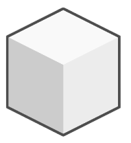
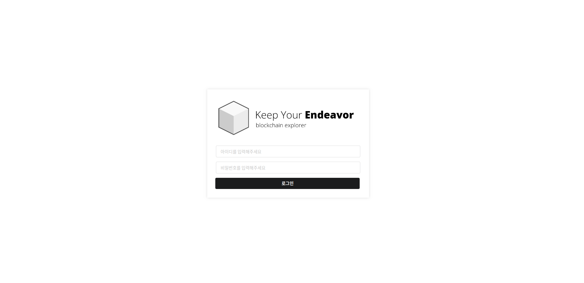
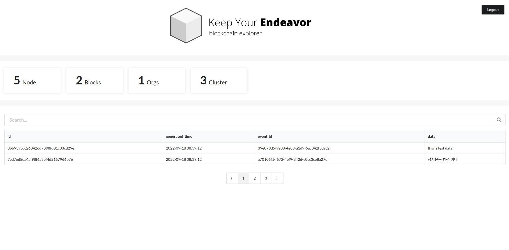

<p align="center">
  <a href="https://github.com/osamhack2022/CLOUD_WEB_IOT_KeepYourEndeavor_Moment" target="_blank" rel="noopener noreferrer">
    
  </a>
</p>
<h1 align="center">KY2 Chain</h1>
<h4 align="center">빠르고 안전한 군 전용 프라이빗 블록체인</h4>
<br/>
`KY2-Chain`은 **Keep Your Endeavor (블록체인 기반 공정한 병기본 솔루션)** 서비스의 데이터 무결성을 보증하기 위해 만들어진 허가형 블록체인 입니다.  타입스크립트를 기반으로 개발되었으며 메시징 서비스 `Kafka` 를 활용해 강력한 로드밸런싱과 빠른 속도를 보장합니다. 모든 데이터는 암호화 되어 `Couchbase`에 저장되여 네트워크가 허가된 사용자만이  자체적으로 제공하는 `KY2 Explorer`에서 블록데이터를 조회할 수 있습니다.

### 로드밸런싱
`Kafka Topic` 과 `Groupid`  를 활용해서 하나의 블록체인 프로토콜에서 서로 간섭받지 않는 채널을 생성할 수 있습니다.

### 노드
#### 콘솔
`React`를 기반으로 제작한 블록체인 콘솔입니다. 
#### 피어
다른 피어와 원장을 공유하며 블록체인을 일치시키는 역할을 진행합니다.

## 블록체인 설치 및 실행 방법
아래와 같은 환경을 권장합니다.
|service|version|
|--|--|
|**NodeJS**|v14|
|**Kafka**|3.2.x|
|Couchbase ottoman|v2|
|Docker|20.10.14|

프로젝트 실행방법은 `npm` 과 `docker` 두 가지 방식이 있습니다.
### 1. 도커 실행 방식
[KY2 도커 이미지](https://hub.docker.com/) 를 빌드해서 자동으로 개발환경을 세팅한 후 피어로 호스팅 해줍니다.
```
$ docker run --name peer001 \
-p 8000:8000 \
```
### 2. NPM 방식
[NPM 저장소](https://www.npmjs.com/) 에서 `KY2 Chain`을 다운 받습니다.
```
$ npm install ky2
```
카프카가 작동중이지 않다면 `Docker-compose` 로 카프카를 구동시킨 뒤 피어를 가동시킵니다. 
```
$ npm start
```

## REST API
### Get Blocks
블록을 조회할 때 사용하는 API 입니다.

**Request**
`GET` `/v1/block/`
```shell
curl -i -H 'Accept: application/json' 
http://localhost:5000/block
```
**Response**
```json
{"blocks":{
	"rows":[{
		"_type":"Block",
		"data": "this is test data",
		"event_id":"39e073d5-9e83-4e83-a1d9-6ac842f3dac2",
		"generated_time":1663501152631,
		"id":"3b6939cdc260426d7898fd01c03cd29e"
	}],
	"meta":{
		"requestId":"428c86df-3a2a-4c7d-9090-d2817dca18e3",
		"clientContextId":"26d5ca8c84f16f74",
		"status":"success",
		"signature":{
			"_type":"json",
			"data":"json",
			"event_id":"json",
			"generated_time":"json",
			"id":"json",
			"organization":"json"
		},
		"warnings":[],
		"metrics":{
			"elapsedTime":2083.13555,
			"executionTime":1919.214984,
			"sortCount":0,
			"resultCount":2,
			"resultSize":340,
			"mutationCount":0,
			"errorCount":0,
			"warningCount":0
		}
	}
}}
```
### Add Block
**Request**
`POST` `/v1/block/`
```shell
curl -i -H 'Accept: application/json' -d 'data=test' 
http://localhost:5000/block
```
**Response**
```json
true
```
## Blockchain Explorer
블록체인 데이터를 손쉽게 조회하고 상태를 확인할 수 있는 탐색기를 제공합니다. 
탐색기는 `React`를 사용해서 개발했습니다.

#### 로그인 페이지

#### 메인페이지

